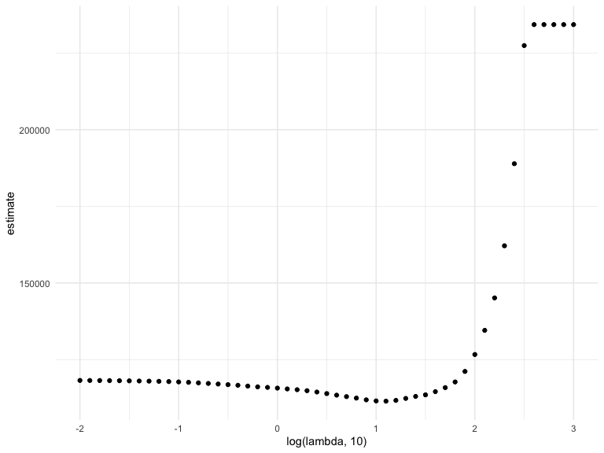

Statistical_methods
================
Yangyang Chen
2023-12-07

``` r
set.seed(11)
```

``` r
bwt_df = 
  read_csv("data/birthweight.csv") |> 
  janitor::clean_names() |>
  mutate(
    babysex = as.factor(babysex),
    babysex = fct_recode(babysex, "male" = "1", "female" = "2"),
    frace = as.factor(frace),
    frace = fct_recode(
      frace, "white" = "1", "black" = "2", "asian" = "3", 
      "puerto rican" = "4", "other" = "8"),
    malform = as.logical(malform),
    mrace = as.factor(mrace),
    mrace = fct_recode(
      mrace, "white" = "1", "black" = "2", "asian" = "3", 
      "puerto rican" = "4")) |> 
  sample_n(200)
```

    ## Rows: 4342 Columns: 20
    ## ── Column specification ────────────────────────────────────────────────────────
    ## Delimiter: ","
    ## dbl (20): babysex, bhead, blength, bwt, delwt, fincome, frace, gaweeks, malf...
    ## 
    ## ℹ Use `spec()` to retrieve the full column specification for this data.
    ## ℹ Specify the column types or set `show_col_types = FALSE` to quiet this message.

get predictors and outcome.

``` r
x = model.matrix(bwt ~., bwt_df)[, -1]
y = bwt_df |> pull(bwt)
```

``` r
lambda = 10^(seq(3, -2, -0.1))

lasso_fit = 
  glmnet(x,y, lambda = lambda)

lasso_cv = 
  cv.glmnet(x, y, lambda = lambda)

lambda_opt = lasso_cv$lambda.min
```

let’s look at lasso results!

``` r
lasso_fit |> 
  broom::tidy() |> 
  filter(step == 42)
```

    ## # A tibble: 20 × 5
    ##    term               step  estimate lambda dev.ratio
    ##    <chr>             <dbl>     <dbl>  <dbl>     <dbl>
    ##  1 (Intercept)          42 -4152.    0.0794     0.635
    ##  2 babysexfemale        42    77.3   0.0794     0.635
    ##  3 bhead                42    84.3   0.0794     0.635
    ##  4 blength              42    72.2   0.0794     0.635
    ##  5 fincome              42     0.498 0.0794     0.635
    ##  6 fraceblack           42   157.    0.0794     0.635
    ##  7 fraceasian           42   -40.2   0.0794     0.635
    ##  8 fracepuerto rican    42   113.    0.0794     0.635
    ##  9 gaweeks              42    25.3   0.0794     0.635
    ## 10 malformTRUE          42   542.    0.0794     0.635
    ## 11 menarche             42   -38.3   0.0794     0.635
    ## 12 mheight              42     5.70  0.0794     0.635
    ## 13 momage               42    -0.962 0.0794     0.635
    ## 14 mraceblack           42  -284.    0.0794     0.635
    ## 15 mraceasian           42    -0.989 0.0794     0.635
    ## 16 mracepuerto rican    42  -299.    0.0794     0.635
    ## 17 ppbmi                42     2.93  0.0794     0.635
    ## 18 ppwt                 42    -1.12  0.0794     0.635
    ## 19 smoken               42    -4.45  0.0794     0.635
    ## 20 wtgain               42     2.96  0.0794     0.635

``` r
lasso_fit |> 
  broom::tidy() |> 
  select(term, lambda, estimate) |> 
  filter(term != "(Intercept)") |> 
  complete(term, lambda, fill = list(estimate = 0)) |> 
  ggplot(aes(x = log(lambda, 10), y = estimate, group = term, color = term)) +
  geom_path()
```


Show the CV results.

``` r
lasso_cv |> 
  broom::tidy() |> 
  ggplot(aes(x = log(lambda, 10), y = estimate)) +
  geom_point()
```


